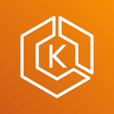
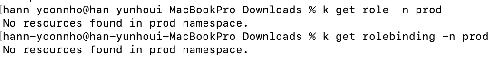
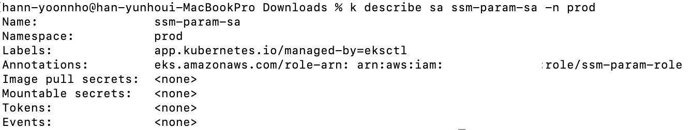
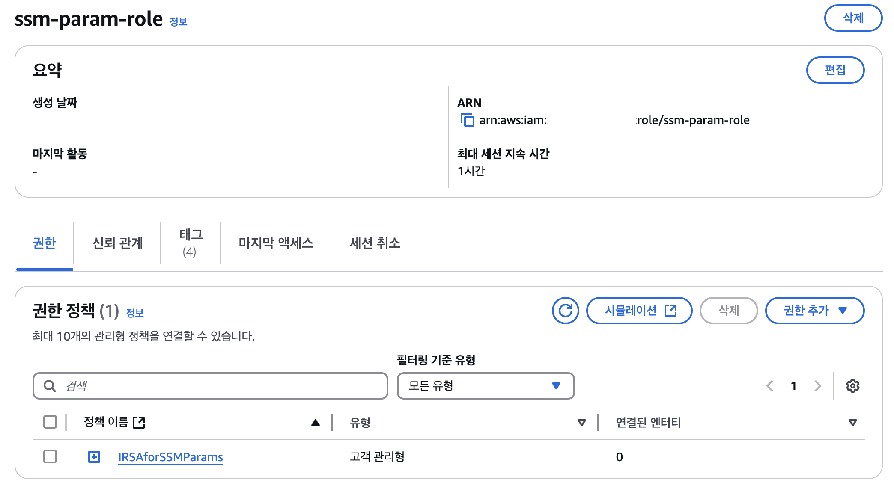
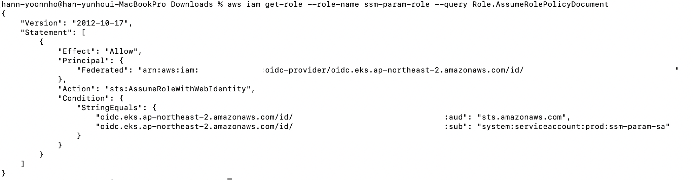

> Translated from the original Velog post: [[K8s] AWS Access Key 대신 AWS IRSA 적용하기 (+EKS Pod Identity)](https://velog.io/@hnnynh/K8s-AWS-Access-Key-%EB%8C%80%EC%8B%A0-IRSA-%EC%A0%81%EC%9A%A9%ED%95%98%EA%B8%B0)



Applications need credentials to sign AWS API requests.
One common approach is to create an IAM user, issue access keys, store them as Kubernetes Secrets, and mount or inject them into Pods.
IRSA provides a safer alternative for EKS workloads.

This post assumes AWS and EKS.

## What Is IRSA?

IRSA means IAM Roles for Service Accounts.
It maps an AWS IAM role to a Kubernetes ServiceAccount.

When an application runs as a Pod with that ServiceAccount, it can access AWS services using the IAM role associated with the ServiceAccount.
This allows cloud permissions to be assigned to Kubernetes workloads without storing long-lived AWS access keys in the cluster.

## Why Use IRSA?

Without IRSA, an application can access AWS services by using IAM user credentials stored as Kubernetes Secrets:

```yaml
env:
  - name: AWS_ACCESS_KEY
    valueFrom:
      secretKeyRef:
        name: secret
        key: awsAccessKey
  - name: AWS_SECRET_ACCESS_KEY
    valueFrom:
      secretKeyRef:
        name: secret
        key: awsSecretKey
```

Kubernetes Secrets are base64-encoded, not encrypted by default in a way that removes all exposure risk.
If long-lived AWS credentials are leaked, the impact can be severe.
Even when credentials are managed outside the application, the mechanism used to access those credentials can face similar security concerns.

IRSA improves this model:

- Least privilege: assign minimal IAM policies to a specific role.
- Workload scoping: grant access only to Pods using a specific ServiceAccount.
- Credential isolation: workloads retrieve only credentials associated with their ServiceAccount.
- Auditability: AWS CloudTrail can log access and events.

## How IRSA Works

IRSA is safer than static user credentials because it uses temporary credentials.
AWS Security Token Service issues those credentials.

The flow depends on OIDC.
OIDC can issue an ID token in JWT format.
EKS exposes an OIDC issuer for the cluster, and AWS IAM can trust that issuer.

The Pod's projected ServiceAccount token is passed to AWS STS through `AssumeRoleWithWebIdentity`.
AWS validates the token, checks the IAM role trust policy, and returns temporary credentials with an expiration time.
The application then uses those temporary credentials to access AWS services.

## EKS Pod Identity

Amazon EKS Pod Identity is another way to provide AWS credentials to EKS workloads.
It is similar in purpose to IRSA, but it does not use OIDC in the same way.
Instead, EKS provides an auth API and a Pod Identity Agent that runs on each node.

It has similar benefits:

- Least privilege
- Credential isolation
- Auditability

It also improves some operational aspects:

- Role and ServiceAccount associations are managed through EKS.
- A single IAM role can be reused across multiple clusters and ServiceAccounts.
- Credential load is handled at the node level instead of duplicated per Pod.

The core idea is still similar: associate an IAM role with a Kubernetes ServiceAccount.
The implementation differs, and EKS Pod Identity is specific to EKS.

## Applying IRSA

The goal is to replace access-key-based environment variables or mounted credentials with a ServiceAccount mapped to an IAM role.
The process follows AWS documentation for assigning IAM roles to Kubernetes ServiceAccounts.

### 1. Check the OIDC Provider

First, confirm whether an IAM OIDC provider exists for the cluster:

```sh
cluster_name=<cluster_name>
oidc_id=$(aws eks describe-cluster --name $cluster_name --query "cluster.identity.oidc.issuer" --output text | cut -d "/" -f 5)
aws iam list-open-id-connect-providers | grep $oidc_id | cut -d "/" -f4
```

If the command returns a value, the provider already exists.
If not, create an IAM OIDC provider for the cluster.

### 2. Create an IAM Policy

Create a policy for the required AWS permissions.
For SSM Parameter Store access, the policy can look like this:

```json
{
  "Version": "2012-10-17",
  "Statement": [
    {
      "Sid": "SSMRead",
      "Effect": "Allow",
      "Action": [
        "ssm:GetParameters",
        "ssm:GetParameter",
        "ssm:GetParametersByPath"
      ],
      "Resource": "arn:aws:ssm:*:<account_id>:parameter/*"
    },
    {
      "Sid": "SSMDescribe",
      "Effect": "Allow",
      "Action": "ssm:DescribeParameters",
      "Resource": "*"
    }
  ]
}
```

### 3. Create and Attach the ServiceAccount

Use `eksctl` to create a ServiceAccount in the target namespace and attach the IAM policy:

```sh
eksctl create iamserviceaccount \
  --name <service_account_name> \
  --namespace <namespace> \
  --cluster <eks_cluster> \
  --role-name <role_name> \
  --attach-policy-arn arn:aws:iam::<account_id>:policy/<policy_name> \
  --approve
```

The role here is an AWS IAM role, not a Kubernetes RBAC role.
Kubernetes `Role` and `RoleBinding` resources are not created for this IAM role.



The generated ServiceAccount has an annotation pointing to the IAM role.



AWS also shows the IAM role connected to the desired policy.



If the ServiceAccount already exists, the role can also be created and annotated manually with the AWS CLI.

### 4. Verify the Configuration

Check the IAM role trust policy:

```sh
aws iam get-role --role-name <role_name> --query Role.AssumeRolePolicyDocument
```



Also verify:

- The IAM policy has the intended permissions.
- The ServiceAccount has the correct IAM role annotation.
- The role trust policy references the correct cluster OIDC provider and ServiceAccount.

## Before: Mounted AWS Credentials

Before IRSA, AWS credentials can be mounted as files:

```yaml
apiVersion: apps/v1
kind: Deployment
metadata: ...
spec:
  template:
    spec:
      containers:
        - name: app
          volumeMounts:
            - name: aws-config
              mountPath: /root/.aws/config
              subPath: config
            - name: aws-credentials
              mountPath: /root/.aws/credentials
              subPath: credentials
      volumes:
        - name: aws-config
          secret:
            secretName: aws-config
        - name: aws-credentials
          secret:
            secretName: aws-credentials
```

## After: ServiceAccount with IRSA

Remove the credential volumes and set `serviceAccountName`:

```yaml
apiVersion: v1
kind: Pod
metadata: ...
spec:
  serviceAccountName: ssm-param-sa
  containers:
    - name: app
      image: <image>
```

The application can now access AWS services through the IAM role mapped to that ServiceAccount, within the permissions allowed by the role.

Depending on the application framework, additional dependencies or SDK configuration may be required.
For example, Spring applications may need STS-related dependencies or configuration.
