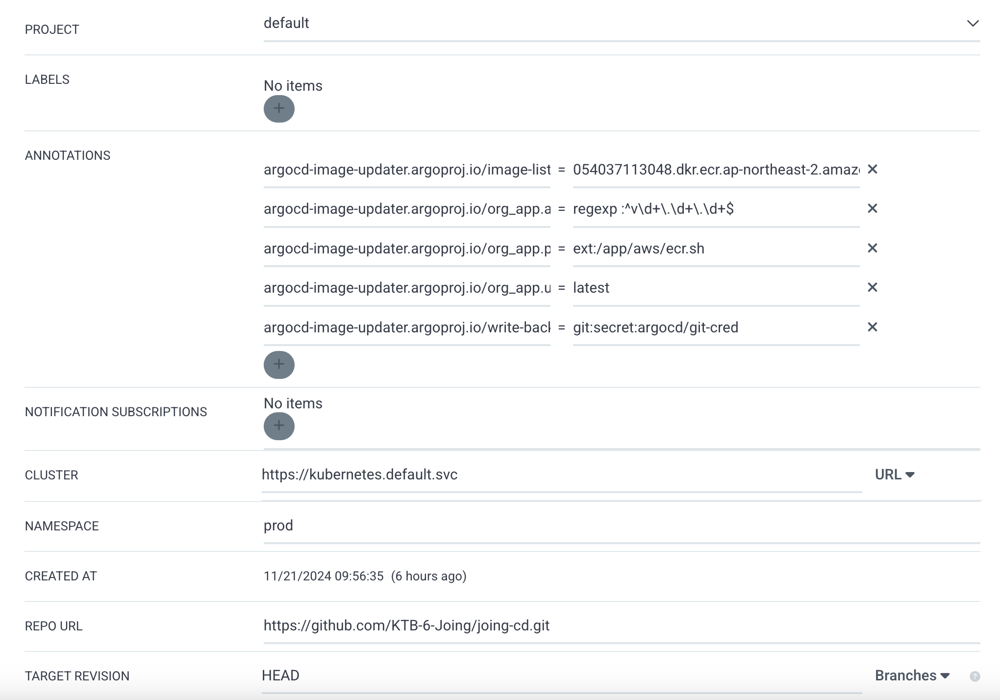
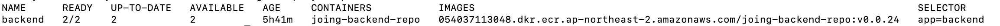
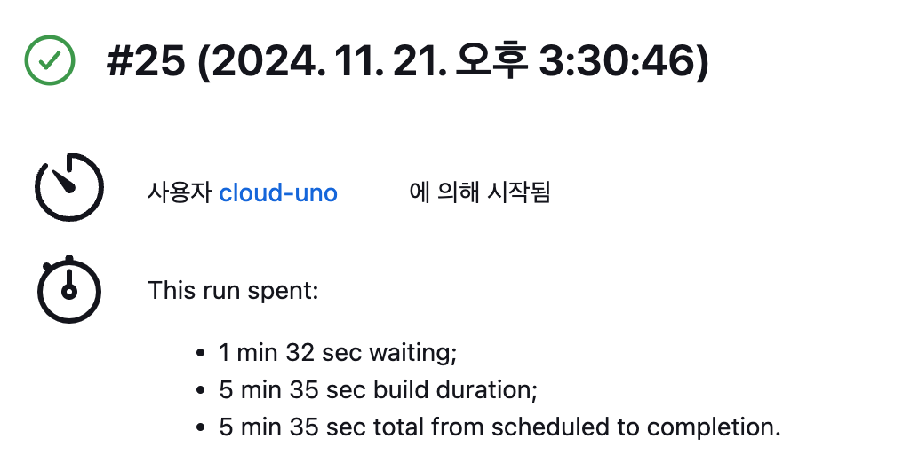
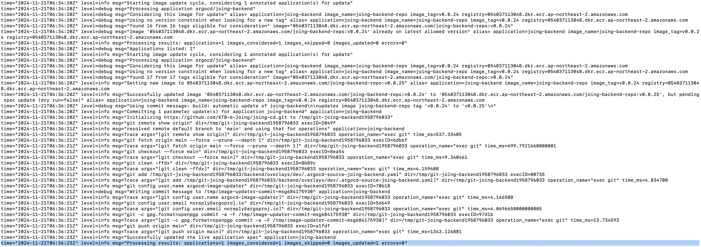
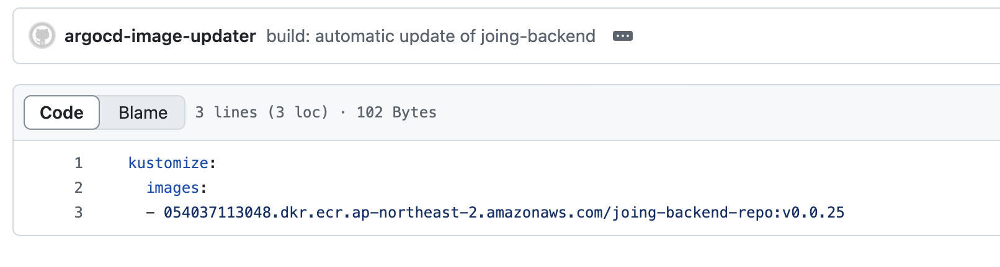
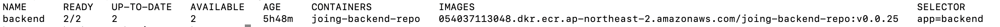
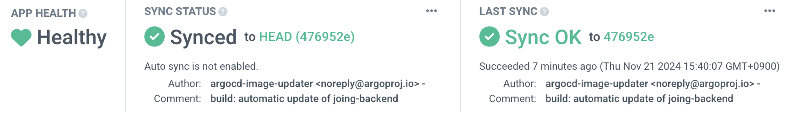

> Translated from the original Velog post: [[CD] ArgoCD Image Updater를 활용한 Continuous Delivery w/AWS ECR](https://velog.io/@hnnynh/CD-ArgoCD-Image-Updater%EB%A5%BC-%ED%99%9C%EC%9A%A9%ED%95%9C-Continuous-Delivery-wAWS-ECR)


Argo CD was selected so deployment state could be managed through a GUI and rollback history could be inspected easily.

## Choosing the CD Stack

At first, environments were not separated, so the CD repository was structured without Kustomize:

```txt
.
├── README.md
└── backend
    ├── deployment.yaml
    ├── hpa.yaml
    ├── ingress.yaml
    └── service.yaml
```

Argo CD was configured to track that repository.

### Continuous Delivery

Argo CD watches the GitHub repository and synchronizes it with the cluster for CD, while Jenkins handles CI.
Then how should the Continuous Delivery step between them work?

After a new image was pushed to ECR, the image tag in the repository containing the Kubernetes manifests needed to be updated.

One option was to update GitHub directly from the Jenkins pipeline.
However, pushing commits from Jenkins through SSH adds operational complexity and does not use Argo CD's visibility as effectively.

Flux CD was also considered, but Argo CD's GUI made it easier to inspect and operate the deployment flow.
Argo CD also had more troubleshooting material available.

While looking for a way to update image tags, [Argo CD Image Updater](https://argocd-image-updater.readthedocs.io/) fit the workflow well.
Since Argo CD was already responsible for deployment, letting Argo CD handle the image update flow was a natural extension.

## Argo CD Image Updater

> A tool to automatically update the container images of Kubernetes workloads that are managed by Argo CD.

As the description says, it is an Argo CD tool that automatically updates container images.

One thing to note is that it is still under active development, so it is not recommended for critical environments.
At the time of writing, v1 had not been released yet, and the latest version was v0.15.1.

The features that mattered most for this project's Continuous Delivery flow were:

- Tracking private ECR image updates with `latest` / `newest-build`
- Managing application manifests with Kustomize
- Updating image tags in GitHub

### Kustomize

Argo CD Image Updater only supports image updates for Argo CD applications generated from Helm or Kustomize.

The folder structure was changed as follows, and `backend/overlays/dev` was applied to the cluster and Argo CD:

```txt
.
├── README.md
└── backend
    ├── base
    │   ├── deployment.yaml
    │   ├── hpa.yaml
    │   ├── ingress.yaml
    │   ├── kustomization.yaml
    │   └── service.yaml
    └── overlays
        └── dev
            └── kustomization.yaml
```

## Argo CD Image Updater Setup

The setup followed the [official documentation](https://argocd-image-updater.readthedocs.io/).

Method 1 from the [installation guide](https://argocd-image-updater.readthedocs.io/en/stable/install/installation/) was used to install it with YAML.
The following resources were created:

```txt
serviceaccount/argocd-image-updater created
role.rbac.authorization.k8s.io/argocd-image-updater created
clusterrole.rbac.authorization.k8s.io/argocd-image-updater created
rolebinding.rbac.authorization.k8s.io/argocd-image-updater created
clusterrolebinding.rbac.authorization.k8s.io/argocd-image-updater created
configmap/argocd-image-updater-config created
configmap/argocd-image-updater-ssh-config created
secret/argocd-image-updater-secret created
deployment.apps/argocd-image-updater created
```

After installation, the required settings were changed manually.

### `argocd-image-updater-config`

Add the following configuration to the `argocd-image-updater-config` ConfigMap:

```yaml
data:
  log.level: debug # default: info
  registries.conf: |
    registries:
      - name: AWS ECR
        api_url: https://<AWS_ACCOUNT_ID>.dkr.ecr.<AWS_REGION>.amazonaws.com
        prefix: <AWS_ACCOUNT_ID>.dkr.ecr.<AWS_REGION>.amazonaws.com
        ping: yes
        credentials: ext:/app/aws/ecr.sh
        credsexpire: 12h # ECR tokens expire after 12 hours
        tagsortmode: latest-last
```

`log.level` was set to print detailed logs, and `registries.conf` was added to connect to the ECR repository.
To connect to ECR, an additional Secret must be configured and `/app/aws/ecr.sh` must be mounted.

Because ECR tokens expire after 12 hours, `credsexpire` must be set.

If you use a registry other than ECR, refer to the examples in the official documentation.

### AWS Credentials and Update Script

To access ECR, credentials and a command for retrieving the ECR password are required.

```txt
# config
[default]
region = ap-northeast-2

# credentials
[default]
aws_access_key_id = ...
aws_secret_access_key = ...
```

```sh
# ecr.sh
#!/bin/sh
aws ecr --region ap-northeast-2 get-authorization-token --output text --query 'authorizationData[].authorizationToken' | base64 -d
```

```sh
kubectl create secret generic aws-config --from-file=config -n argocd
kubectl create secret generic aws-cred --from-file=credentials -n argocd
kubectl create configmap ecr-pwd --from-file=ecr.sh -n argocd
```

Then modify the `argocd-image-updater` Deployment to mount each Secret and ConfigMap:

```yaml
containers:
  - volumeMounts:
      - mountPath: /app/.aws/config
        name: aws-config
        subPath: config
      - mountPath: /app/.aws/credentials
        name: aws-credentials
        subPath: credentials
      - mountPath: /app/aws
        name: script-volume
volumes:
  - name: aws-config
    secret:
      defaultMode: 420
      secretName: aws-config
  - name: aws-credentials
    secret:
      defaultMode: 420
      secretName: aws-cred
  - configMap:
      defaultMode: 511
      name: ecr-pwd
    name: script-volume
```

## Argo CD

Next, Argo CD and Argo CD Image Updater need to be connected.
If they are running in the same cluster and namespace, no separate Argo CD endpoint setting is required.

The important point is that annotations must be added to the Argo CD Application.

### GitHub Token

Before configuring Argo CD, create a GitHub token with push permission and register it as a Secret in the `argocd` namespace:

```sh
kubectl create secret generic git-cred -n argocd \
  --from-literal=username=... \
  --from-literal=password=<TOKEN>
```

The token can be stored in `argocd-image-updater-secret` or in a separate Secret.
The important part is to reference it correctly from Argo CD Image Updater.

Refer to the [update methods documentation](https://argocd-image-updater.readthedocs.io/en/stable/basics/update-methods/) for details.

### Annotations

Add annotations from the existing `Application > Details > Summary` page.

```yaml
argocd-image-updater.argoproj.io/image-list: <AWS_ACCOUNT_ID>.dkr.ecr.<AWS_REGION>.amazonaws.com/<ECR_REPO>
argocd-image-updater.argoproj.io/org_app.allow-tags: regexp:^v\d+\.\d+\.\d+$ # vN.N.N format tags
argocd-image-updater.argoproj.io/org_app.pull-secret: ext:/app/aws/ecr.sh
argocd-image-updater.argoproj.io/org_app.update-strategy: latest # latest/newest-build
argocd-image-updater.argoproj.io/write-back-method: git:secret:argocd/git-cred # GitHub Secret
```

At this point, the setup is complete: when the ECR repository is updated, the image tag in the GitHub repository is automatically updated.



## Verifying the Flow



First, check the image tag `v0.0.24`.
The `24` at the end represents the Jenkins build number.
The next tag is `v0.0.25`, so run the 25th pipeline.



After the pipeline finishes, verify that the image has been updated in the ECR repository.

By default, Argo CD Image Updater checks registered repositories every two minutes.
The Image Updater logs showed that the tag change had been reflected in GitHub.



The change was applied under `./backend/overlays/dev` in GitHub, and Argo CD detected the change as `OutOfSync`.




After pressing Sync, the image was updated through the configured `RollingUpdate`.





## Closing

Argo CD Image Updater can connect ECR image updates to Git-based Kubernetes manifests without putting tag update logic directly into Jenkins.
For non-critical environments, it provides a practical way to automate image tag updates while keeping Argo CD as the deployment control point.
