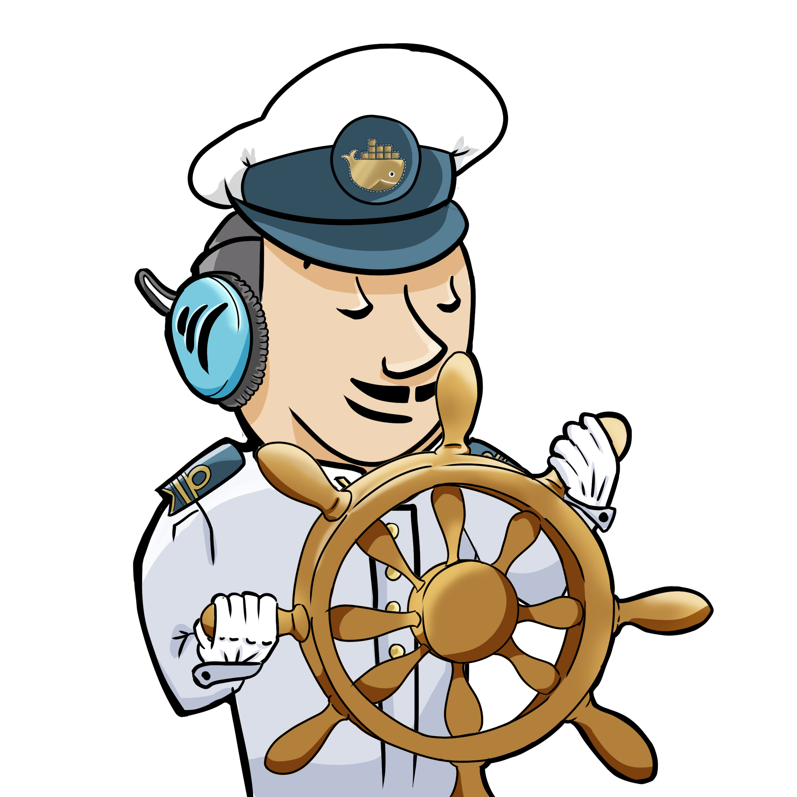
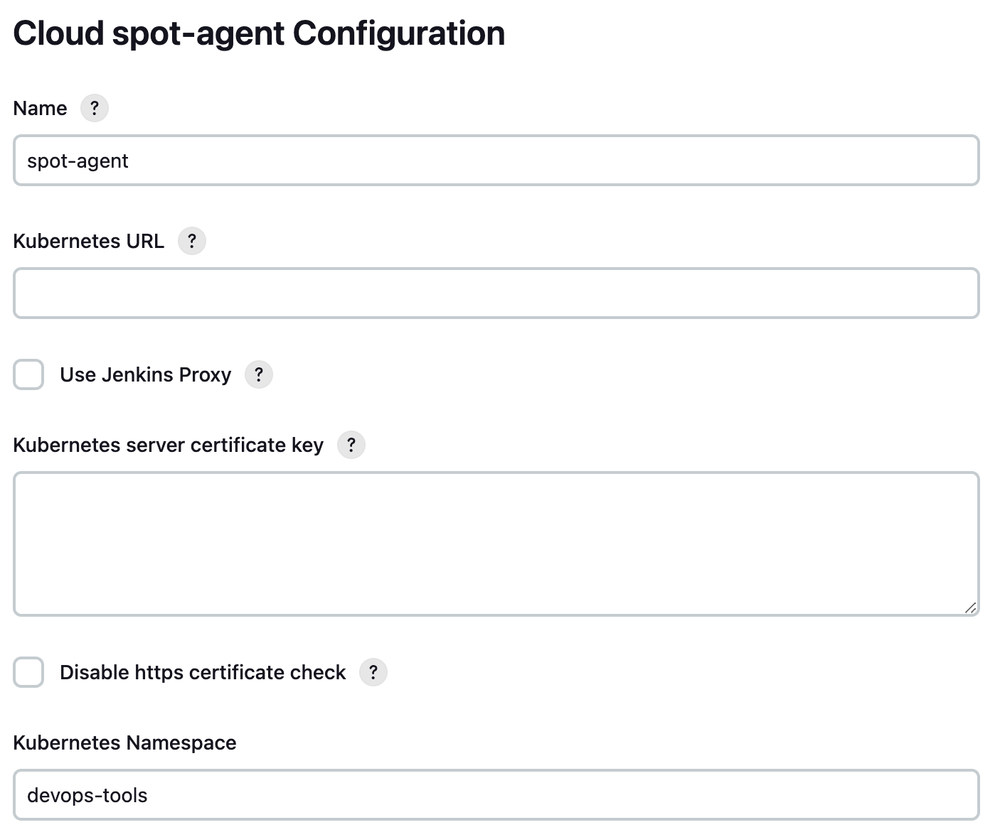
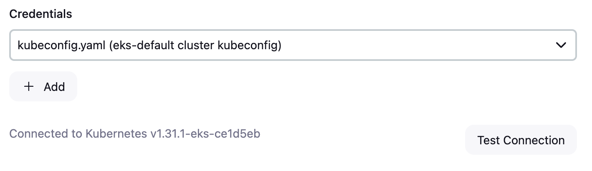
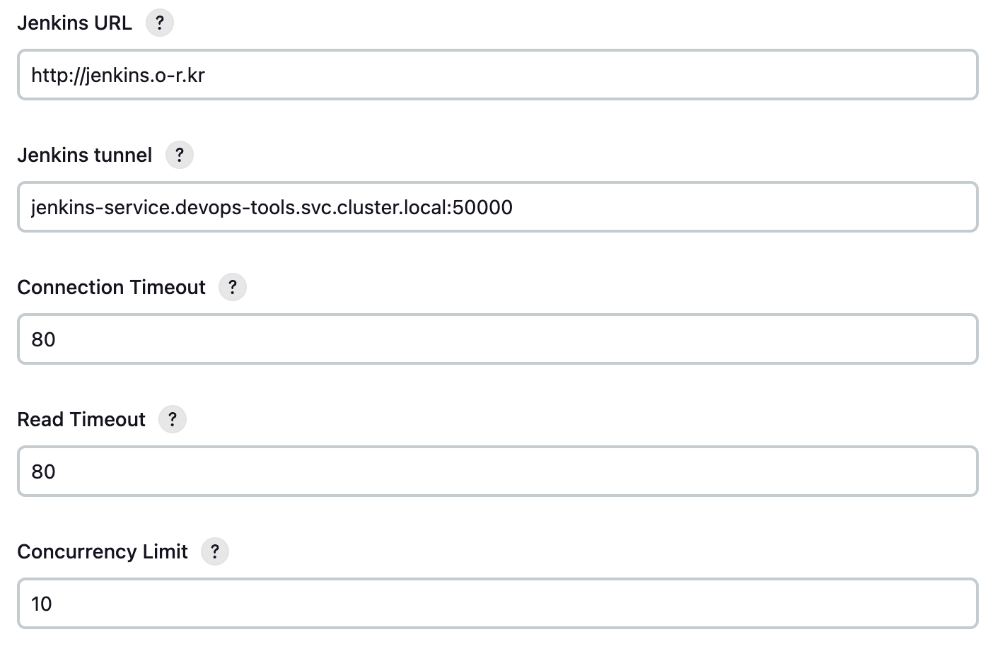
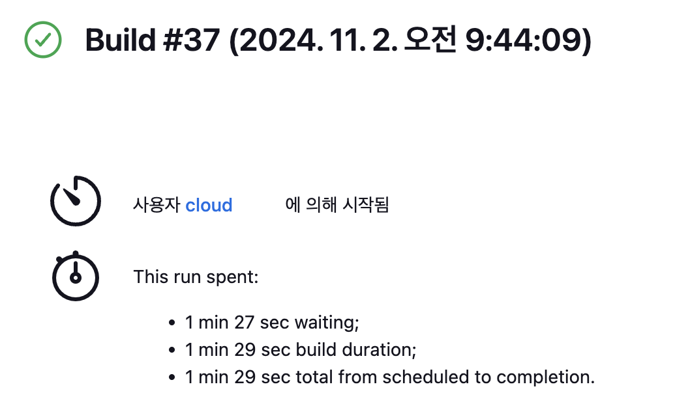

> Translated from the original Velog post: [[CI] Spot Instance로 Jenkins Kubernetes cloud agent 구성하기](https://velog.io/@hnnynh/CI-Spot%EC%9C%BC%EB%A1%9C-Jenkins-Kubernetes-cloud-agent-%EA%B5%AC%EC%84%B1%ED%95%98%EA%B8%B0)



This post describes a Jenkins CI setup where the Jenkins controller runs on stable on-demand nodes and build agents run as Kubernetes Pods on EKS spot nodes.

## Design

The production workloads and Jenkins controller were deployed to on-demand nodes.
Additional build capacity was provided by a separate spot node group that scales from zero.

Example node group configuration:

```hcl
{
  name                = "ondemand_medium"
  spot_enabled        = false
  release_version     = "1.31.0-20241011"
  disk_size           = 20
  ami_type            = "AL2023_x86_64_STANDARD"
  node_instance_types = ["t3.medium"]
  node_min_size       = 2
  node_desired_size   = 2
  node_max_size       = 2
  labels = {
    "cpu_chip"  = "intel"
    "node-type" = "ondemand"
  }
},
{
  name                = "spot_medium"
  spot_enabled        = true
  disk_size           = 20
  release_version     = "1.31.0-20241011"
  ami_type            = "AL2023_x86_64_STANDARD"
  node_instance_types = ["t3.medium"]
  node_min_size       = 0
  node_desired_size   = 0
  node_max_size       = 2
  labels = {
    "cpu_chip"  = "intel"
    "node-type" = "spot"
    "jenkins"   = "true"
  }
}
```

The Jenkins controller can be resource-limited and kept on on-demand nodes.
Build pipelines can be heavier and less predictable, so they are forced onto spot nodes with a `nodeSelector`.

The intended flow is:

- Jenkins agent Pod has `nodeSelector: jenkins=true`.
- The scheduler needs a node with that label.
- If no spot node exists, Cluster Autoscaler scales out the spot node group.
- The agent Pod runs on the new or existing spot node.
- After the build completes, the agent Pod is deleted.

Benefits:

- Controller and build-agent responsibilities are separated.
- Spot instances reduce build cost.
- The spot node group scales out only when needed.
- Existing EKS node group and Jenkins plugin features can be used without custom AWS automation.

Tradeoffs:

- Initial builds wait for spot node provisioning.
- Node readiness can increase pipeline timeout requirements.
- Image cache is unavailable when new nodes are created.
- Spot interruption behavior must be considered.

## Jenkins Installation and kubeconfig

Jenkins needs a ServiceAccount with permission to create Pods.
The official Jenkins Kubernetes installation creates a `jenkins-admin` ServiceAccount.
Its kubeconfig can be registered in Jenkins credentials so Jenkins can create agent Pods.

Because a ServiceAccount token is not always created automatically, create a token Secret:

```yaml
apiVersion: v1
kind: Secret
metadata:
  name: jenkins-admin-token
  namespace: devops-tools
  annotations:
    kubernetes.io/service-account.name: jenkins-admin
type: kubernetes.io/service-account-token
```

Get the token:

```sh
kubectl get secret jenkins-admin-token -n devops-tools -o jsonpath='{.data.token}' | base64 --decode
```

Get the cluster CA certificate:

```sh
kubectl get configmap -n kube-system kube-root-ca.crt -o jsonpath='{.data.ca\.crt}' | base64
```

Create a kubeconfig:

```yaml
apiVersion: v1
kind: Config
clusters:
  - name: kubernetes
    cluster:
      certificate-authority-data: <crt>
      server: https://<kubernetes-api-server>
contexts:
  - name: jenkins-admin-context
    context:
      cluster: kubernetes
      namespace: devops-tools
      user: jenkins-admin
current-context: jenkins-admin-context
users:
  - name: jenkins-admin
    user:
      token: <token>
```

Expose Jenkins ports `8080` and `50000` with NodePort or another suitable access method.

## Cluster Autoscaler

Cluster Autoscaler is required when a Pod cannot be scheduled because no matching node exists.
Karpenter can also be used, but this setup uses Cluster Autoscaler.

The key requirement is that the spot node group can scale from zero and has the labels expected by the Jenkins agent Pods.

## Jenkins Kubernetes Plugin

The Jenkins Kubernetes plugin runs dynamic agents inside a Kubernetes cluster.
After installing it, configure Jenkins Cloud settings so Jenkins can connect to the cluster and create Pods.







Important fields:

- Name: cloud name
- Kubernetes URL: API server URL
- Kubernetes Namespace: namespace where agent Pods are created
- Credentials: kubeconfig with permission to create and delete Pods
- Jenkins URL: Jenkins web URL on port `8080`
- Jenkins Tunnel: Jenkins agent connection address on port `50000`, in `host:port` format

`Jenkins URL` refers to the web UI endpoint.
`Jenkins Tunnel` is used for controller-agent communication through JNLP.
WebSocket-based agent connections can also be used depending on configuration.

## Run Agents on the Spot Node Group

After Cloud configuration, set the agent Pod `nodeSelector` to match the spot node group label.
The label used here is `jenkins=true`.

Example Jenkins pipeline:

```groovy
pipeline {
  agent {
    kubernetes {
      yaml '''
apiVersion: v1
kind: Pod
metadata:
  name: build-env
spec:
  nodeSelector:
    jenkins: "true"
  containers:
    - name: build-env
      image: ubuntu:latest
      command:
        - sleep
      args:
        - infinity
      securityContext:
        runAsUser: 1000
'''
      defaultContainer 'build-env'
      retries 2
    }
  }
  stages {
    stage('Test') {
      steps {
        sh 'hostname'
        echo 'hello world'
      }
    }
  }
}
```

The agent Pod runs on a spot node.
If no matching node exists, the spot node group scales out first.
When the pipeline finishes, Jenkins deletes the agent Pod.

## Result



When scaling from zero spot nodes to one spot node:

- Pipeline start: 09:44:09
- Spot node Ready: 09:45:19
- Time until agent Pod completion: 87 seconds

The scale-out took about one minute.
Karpenter may reduce provisioning latency, but the exact result depends on configuration.

## Notes

If the spot node group has never created a node, Cluster Autoscaler may not recognize it as expected.
One workaround is to temporarily set the node group minimum and desired size to `1`, allow a node to join, and then reduce them back to `0`.

Jenkins X is another Kubernetes-focused CI/CD option.
It provides Kubernetes-native CI/CD features such as GitOps, Tekton pipelines, secret management, pull request ChatOps, and preview environments.
