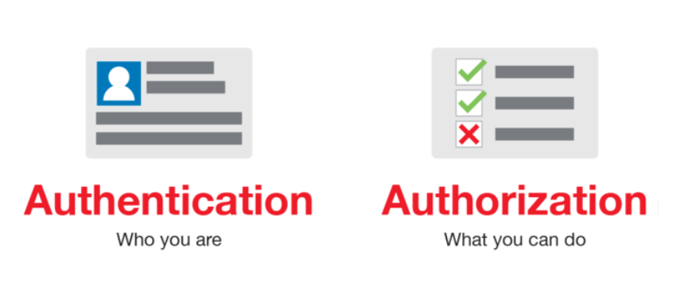
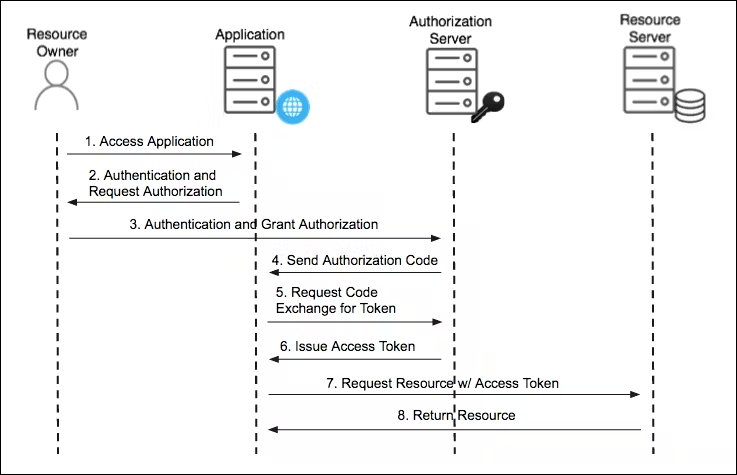
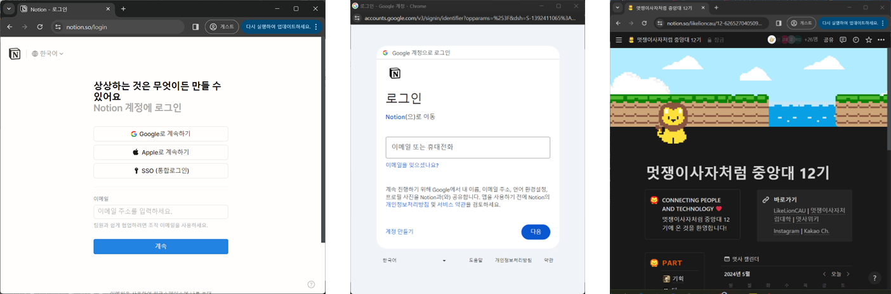
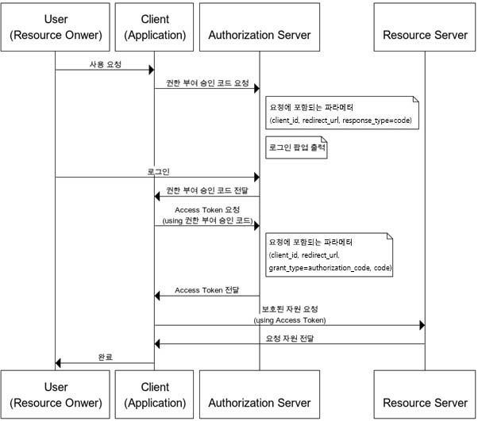
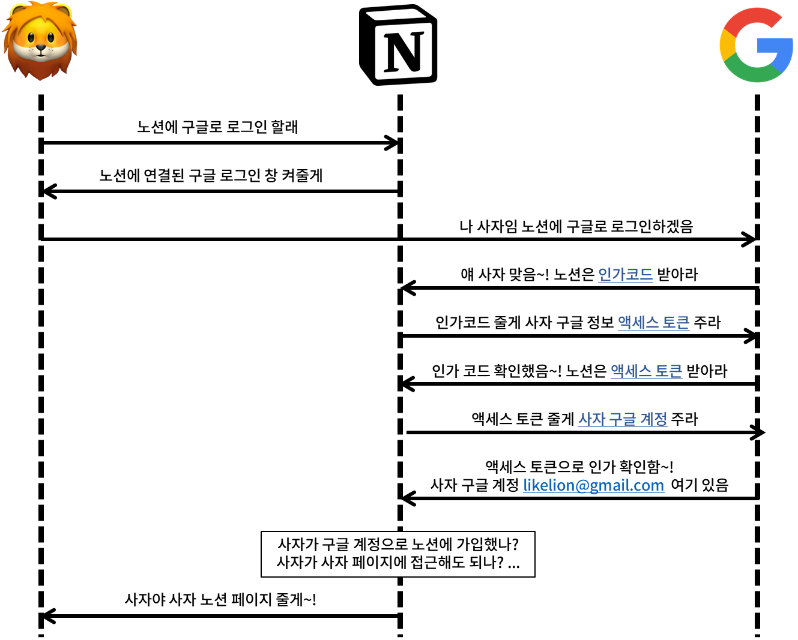

> Translated from the original Velog post: [[OAuth] 소셜로그인을 위한 OAuth 2.0](https://velog.io/@hnnynh/OAuth-%EC%86%8C%EC%85%9C%EB%A1%9C%EA%B7%B8%EC%9D%B8%EC%9D%84-%EC%9C%84%ED%95%9C-OAuth-2.0)

This post summarizes OAuth 2.0 from the perspective of social login.

## Authentication and Authorization

Authentication identifies who the user is.
Authorization decides what the identified user is allowed to access.

OAuth stands for Open Authorization.
It is an authorization framework, more precisely a framework for delegated authorization.

## What Is OAuth 2.0?

OAuth 2.0 defines a structure that allows a third-party client to obtain limited access to protected resources.
The user does not need to give the third-party application their password.
Instead, the authorization server issues tokens that allow limited access.

OAuth 2.0 is widely used for social login because providers such as Google use it for authorization and consent.

Social login is an implementation built on this structure:

- A service wants to use information from a provider such as Google.
- The user authenticates with Google.
- The user grants the service limited access.
- The service receives tokens and requests user information within the approved scope.

## OAuth 2.0 Roles

OAuth 2.0 defines four main roles:

### Resource Owner

The resource owner can grant access to a protected resource.
For social login, this is usually the end user.

Example: the user owns their Google account profile data.

### Resource Server

The resource server hosts protected resources and responds to requests with a valid access token.

Example: Google's API server that returns profile information.

### Client

The client is the application that requests protected resources on behalf of the resource owner.
This is not the same as frontend/backend client terminology.
It means the third-party application requesting access.

Example: Notion using Google login.

### Authorization Server

The authorization server authenticates the resource owner, obtains consent, and issues tokens to the client.

Example: Google's OAuth server.

## OAuth Summary

OAuth allows a third-party client to receive limited access to protected resources.

For Google social login:

- Protected resource: Google account information
- Resource owner: Google account user
- Client: service implementing Google social login
- Authorization server: Google OAuth server
- Resource server: Google APIs

The service receives only data that the user authorizes.



Typical flow:

1. The user opens the client application.
2. The user chooses "Continue with Google."
3. The user is redirected to Google and authenticates.
4. Google returns an authorization code to the client.
5. The client exchanges the authorization code for an access token.
6. The client uses the access token to request user information.
7. Google validates the token and returns the requested data.
8. The client uses that data to sign in or register the user in its own system.



## Authorization Code Grant

The authorization code grant is commonly used for social login.

An authorization code is a short-lived code issued after the user authenticates and grants consent.
The client exchanges that code for an access token.



The authorization request includes parameters such as:

```txt
response_type=code
client_id={client_id}
redirect_uri={redirect_uri}
scope={scope}
```

The token request includes parameters such as:

```txt
grant_type=authorization_code
client_id={client_id}
client_secret={client_secret}
code={code}
redirect_uri={redirect_uri}
```

## Full Example

Assume a user signs up for Notion using Google social login.



1. The user opens Notion.
2. The user selects Google login.
3. Notion redirects the user to Google's OAuth endpoint:

```txt
https://accounts.google.com/o/oauth2/v2/auth?client_id={client_id}&response_type=code&redirect_uri={GOOGLE_CALLBACK_URI}&scope={scope}
```

4. If this is the first login, Google asks whether the user consents to sharing the requested information.
5. Google redirects back to Notion with an authorization code.
6. Notion's backend exchanges the code for tokens:

```txt
https://oauth2.googleapis.com/token?client_id={client_id}&client_secret={client_secret}&code={code}&grant_type=authorization_code&redirect_uri={GOOGLE_CALLBACK_URI}&state={state}
```

7. Notion uses the access token to request user information:

```txt
https://www.googleapis.com/oauth2/v1/tokeninfo?access_token={access_token}
```

8. Google returns user information if the request is valid and within the approved scope.
9. Notion uses an identifier such as email to authenticate or register the user in its own service.



## Why Use Social Login?

Social login is not required.
A service can build its own account system.

Social login is useful when:

- Reducing signup friction matters.
- The service does not want to directly manage user passwords.
- A provider such as Google can authenticate the user and provide a verified identifier.

OAuth does not replace the service's own user model.
It delegates access to provider data so the service can identify the user and then apply its own authentication and authorization logic.

## Summary

OAuth is a delegated authorization framework.
In social login, it allows a service to obtain approved user information from a provider such as Google without handling the user's Google password.

The service usually uses returned identifiers, such as email or provider-specific user ID, to create or match an internal user account.
