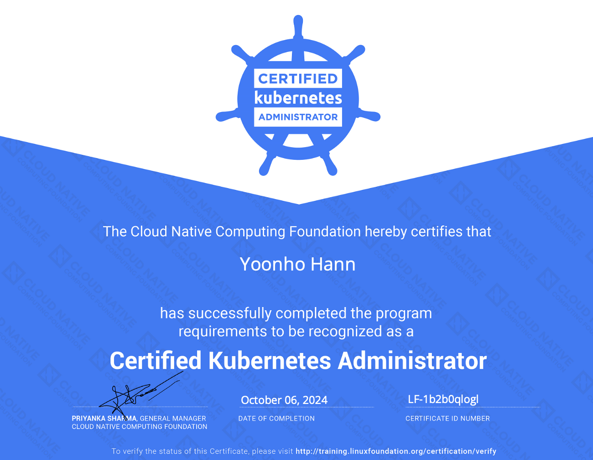
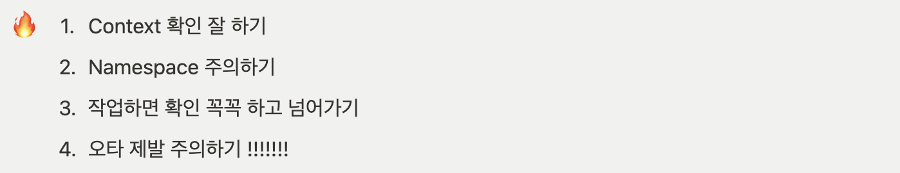
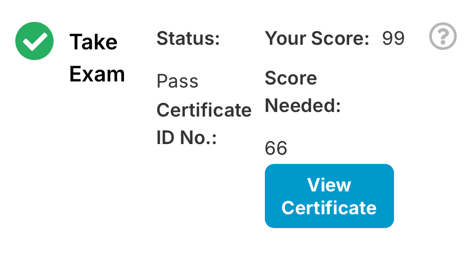

> Translated from the original Velog post: [kubectl 2달이면 CKA 99점을 받는다](https://velog.io/@hnnynh/kubectl-2%EB%8B%AC%EC%9D%B4%EB%A9%B4-CKA-99%EC%A0%90%EC%9D%84-%EB%B0%9B%EB%8A%94%EB%8B%A4)

This post summarizes a roughly two-month CKA preparation process using `kubectl`.
The actual exam workflow used `alias k=kubectl` heavily.

## Starting Point

The starting point was basic Kubernetes awareness: Kubernetes is a container orchestration system.
Concepts such as Minikube, MicroK8s, EKS, clusters, and nodes were not yet clear in detail.

The CKA was completed less than three months after first using `kubectl`.
The following sections summarize the preparation flow that made that possible.

## Preparation Timeline

Study started on August 1, and the Kubernetes preparation process followed this timeline:

- 2 weeks: completed and summarized Mumshad Mannambeth's Kubernetes course
- 3 weeks: worked on a project using EKS
- 3 weeks: reviewed the course again and solved practice problems

In total, it took about 8 to 9 weeks of studying and using Kubernetes.
All of that time contributed to CKA preparation.

### Course Study

The main course was the well-known Udemy course by Mumshad Mannambeth.
It was reviewed about twice.

The course became more useful after hands-on Kubernetes usage.
On the first pass, it introduced the concepts.
After using Kubernetes directly, the second pass helped organize and clarify those concepts.

About a week before the exam, an additional free Korean lecture about preparing for Kubernetes certifications was used to understand the exam format and strategy.
This helped more with understanding the exam itself than with solving specific problems.

### Practice Problems

Mumshad's Lightning Lab and Mock Exams 1, 2, and 3 were each solved at least three times.
The focus was not just to memorize the answers, but to verify whether the concepts behind each problem were understood.

Cluster upgrade problems were especially difficult, so the node upgrade problem from the Lightning Lab was repeated until the flow became clear.

The same exact problems are unlikely to appear on the exam, but it is useful to practice until each problem can be solved while referencing the official documentation.

After that, additional problem types were reviewed through blog posts and public CKA review materials.
Many CKA reviews mention that similar types of questions appear repeatedly.
Searching for CKA practice questions and using them to find weak areas was useful.

One week before the exam, `killer.sh` was used once to become familiar with the exam environment.
The score was much lower than the actual exam score, but that was useful because it exposed weak areas and made the terminal environment feel more familiar.
It also helped practice copy and paste with `Ctrl+Shift+C` and `Ctrl+Shift+V`.

The most important points during practice were:

- Practice finding the right official documentation quickly
- Practice finding useful sample files and adapting them
- Identify concepts or commands that repeatedly cause mistakes

Repeated problem solving also helped build the right exam mindset.

### Hands-on Usage

The initial goal of studying Kubernetes was not only to pass the CKA, but also to use Kubernetes in a project.
For three weeks, Kubernetes was used directly through EKS.

Hands-on usage has clear tradeoffs.
The benefit is that project deadlines create strong motivation, and repeated usage makes Kubernetes commands, manifests, and operational concepts more familiar.
It also exposes practical questions that do not appear in exam-only study.

However, if the only goal is certification, project-based learning can require extra time and effort.
Using Kubernetes in a project without enough prior understanding can also make the project harder to complete reliably.

## Exam Environment

For exam rules and environment details, refer to the Linux Foundation's official instructions for CKA and CKAD.
It is also useful to practice with `killer.sh` and complete the tutorial test provided in the training portal before the exam.

The exam environment checks are strict.
Bookshelves, books, calendars, wall items, and similar objects can become issues during check-in.
If taking the exam at home, prepare the room carefully before check-in.
A clean study room with minimal objects can also be a good option.

Network stability matters.
If possible, use a wired network instead of Wi-Fi.

## Exam Review

The CKA is a hands-on exam, which makes it useful for Kubernetes beginners.
The ability to reference official documentation and the flexible rescheduling/cancellation policy make it feel like a certification designed to encourage practical Kubernetes learning.

The exam fee and remote exam environment are the main drawbacks.

Scoring well on the CKA can be a useful signal that the candidate can operate Kubernetes at a practical level.
After completing CKA, CKAD and CKS can be considered as next steps depending on the desired learning path.

