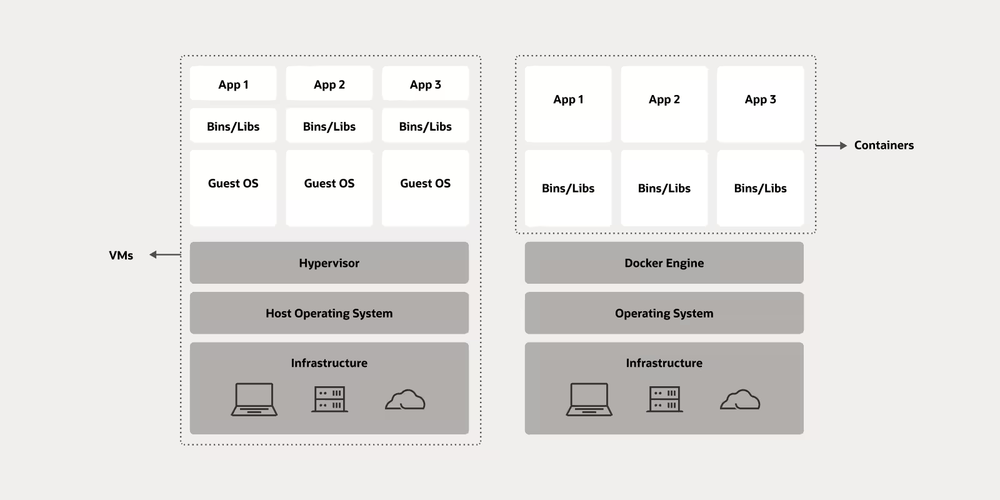
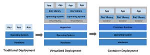
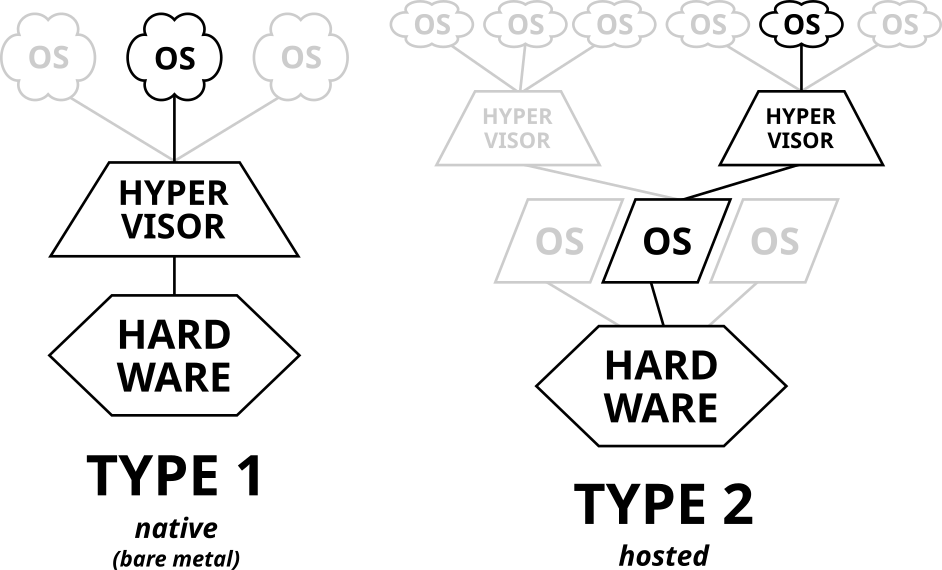

> Translated from the original Velog post: [가상환경 vs 가상화, 가상머신 vs 컨테이너](https://velog.io/@hnnynh/%EA%B0%80%EC%83%81%ED%99%98%EA%B2%BD-vs-%EA%B0%80%EC%83%81%ED%99%94-%EA%B0%80%EC%83%81%EB%A8%B8%EC%8B%A0-vs-%EC%BB%A8%ED%85%8C%EC%9D%B4%EB%84%88)

Terms such as virtual environment, virtualization, virtual machine, and container sound similar, but they describe different layers of isolation.
This post compares those concepts.

## Virtual Environment

In Python, a virtual environment is created on top of an existing Python installation.
It can isolate installed packages from the base Python environment so only packages installed into that virtual environment are used.

### Characteristics

- Used to manage a specific Python interpreter, libraries, and binaries for a project.
- Commonly stored under directories such as `venv`, `.venv`, or `.virtualenvs`.
- Usually excluded from Git; dependencies are declared separately and installed per environment.

Shared with the local system:

- Python interpreter base
- Basic system libraries such as `sys` and `os`
- Environment variables

Isolated from the local system:

- Packages and libraries installed under the virtual environment's `site-packages`
- Python executable under the virtual environment directory
- Commands or scripts that use those packages, such as `django-admin` or `pytest`

### Purpose

- Declare dependencies explicitly.
- Improve version management and troubleshooting.
- Recreate development environments more easily.
- Manage dependencies independently per project.

## Virtualization

Virtualization is the process of abstracting physical computer hardware so it can be used more efficiently.
It is a foundation of cloud computing.

It builds an abstraction layer over hardware and allows one physical machine to be divided into multiple virtual machines.

### Background

Traditional deployment:

- Applications run directly on physical servers.
- Resource boundaries between applications are difficult to define.
- Resource waste, overuse, and interference between applications can occur.

After virtual machines:

- Multiple virtual systems can run on one physical server.
- Applications can be isolated by VM.
- Hardware can be used more efficiently.

After containers:

- Applications share the host operating system.
- Containers still have their own filesystem, CPU share, memory limits, and process space.
- Because the OS is shared, containers are lighter than VMs and provide portability at a higher abstraction level.
- Smaller independent units make microservice-style deployment easier.

## Virtual Machines

A virtual machine is a virtualized environment for a physical computer.
It creates a software-defined computer inside a physical computer so it can run independently.

This post focuses on system virtual machines, not process virtual machines such as the JVM.

For example, VirtualBox allocates storage, memory, and CPU, installs an OS, and boots a separate computer-like environment inside the existing computer.

### Hypervisors

The physical machine running VMs is the host.
The VM running on the host is the guest.
A hypervisor is the software or technology that separates physical hardware into virtual machines.

There are two broad types:

Type 1 hypervisor, or bare-metal hypervisor:

- Runs directly on physical server hardware.
- No host OS is required below the hypervisor.
- Examples: Linux KVM, Microsoft Hyper-V, Xen.
- Lower overhead and efficient hardware control, but requires dedicated management tooling.

Type 2 hypervisor, or hosted hypervisor:

- Runs as software on top of a host OS.
- The host OS manages hardware access.
- Examples: VMware Workstation, VMware Player, VirtualBox, QEMU.
- Easier to use on an existing OS, but can introduce host OS overhead.

Type 1 is generally better for efficiency and scale.
Type 2 is often easier for local development or desktop use.

### Purpose

Virtualization allows host hardware to be divided into multiple VMs.
Workloads can be consolidated onto one physical machine, improving utilization and reducing cost.
Because the hypervisor abstracts hardware allocation, resources can be provisioned and assigned dynamically.

## Containers

A container is a software package that includes the elements needed to run software in a consistent environment.
It usually includes application code, language runtime, libraries, packages, and runtime configuration.

Containers run from container images.
An image contains the source or build artifact, dependencies, and execution environment.

### Container Virtualization

Container virtualization uses a container runtime on top of the host OS.
It isolates applications from one another without virtualizing full hardware.

Unlike hypervisor-based virtualization, container isolation works at the process level.
Linux features such as cgroups, namespaces, and overlay filesystems isolate resources, networks, filesystems, and process spaces.

Common runtimes and tools include Docker Engine, containerd, and runc.
OCI defines open standards for container images and runtimes.

### Purpose

The key difference is kernel sharing.
VMs receive virtualized hardware and run their own OS kernel.
Containers share the host OS kernel and isolate processes at the OS level.

Benefits:

- Lightweight and fast because containers do not need a full guest OS.
- Portable because images package the application runtime environment.
- Efficient because the host kernel is shared.
- Operationally useful because applications can be built, shipped, and run consistently.

Tradeoffs:

- Process-level isolation requires careful security and resource management.
- A host-level problem can affect multiple containers.
- Persistent data requires extra management with volumes or external storage.

## Are Containers Virtual Machines?

No.
The core difference is:

> Virtual machines isolate at the hardware level. Containers isolate at the process level.

A VM has its own OS.
A container can use an OS-like userland from an image such as `ubuntu:22.04`, but it still shares the host kernel.

## Summary

Common point: all of these provide isolated environments to improve efficiency.

Differences:

- Virtual environment: isolates packages and dependencies inside a project directory.
- Virtual machine: isolates hardware through a guest machine running on a host.
- Container: isolates application processes while sharing the host hardware and kernel.
